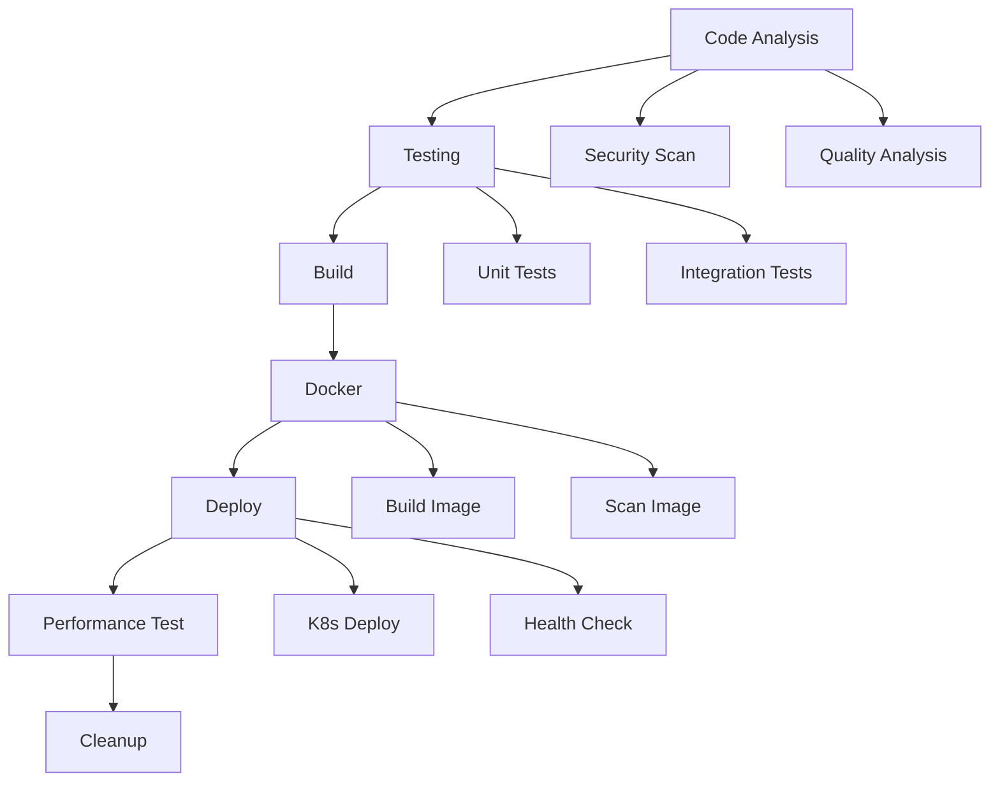

# 🏦 Banking App - Advanced CI/CD Practice Pipeline Guide

## 📋 Overview

This comprehensive CI/CD pipeline (`practice.yml`) is designed for the Spring Boot Banking Application with advanced DevOps practices, security scanning, and automated deployment to AWS EKS.

## 🚀 Pipeline Features

### 🔍 **Code Quality & Security Analysis**
- **Trivy Security Scanning**: Filesystem and container vulnerability scanning
- **Gitleaks**: Secret detection and prevention
- **OWASP Dependency Check**: Vulnerability assessment of dependencies
- **SonarQube Analysis**: Code quality, coverage, and technical debt analysis
- **Quality Gates**: Automated quality checks with pass/fail criteria

### 🧪 **Comprehensive Testing**
- **Multi-Java Version Testing**: Tests on Java 17 and 21
- **Unit & Integration Tests**: Separate test matrices
- **MySQL Service Integration**: Real database testing
- **Test Coverage Reports**: JaCoCo integration
- **Test Result Publishing**: GitHub-native test reporting

### 🏗️ **Build & Package**
- **Version Generation**: Automatic semantic versioning
- **Maven Build**: Optimized with caching
- **Artifact Management**: JAR packaging and storage
- **Build Metadata**: Timestamps and version tracking

### 🐳 **Docker & Container Security**
- **Multi-Platform Builds**: AMD64 and ARM64 support
- **Docker Hub Integration**: Automated image pushing
- **Container Scanning**: Trivy image vulnerability scanning
- **Build Caching**: GitHub Actions cache optimization

### 🚀 **Kubernetes Deployment**
- **AWS EKS Integration**: Automated cluster deployment
- **Environment Management**: Staging and production environments
- **Health Checks**: Application readiness verification
- **Rolling Updates**: Zero-downtime deployments

### 📊 **Performance Testing**
- **Load Testing**: Automated performance validation
- **Health Monitoring**: Application response verification
- **Performance Metrics**: Response time tracking

## 🛠️ Required Secrets & Variables

### 🔐 **GitHub Secrets**
```yaml
# SonarQube
SONAR_TOKEN: "your-sonar-token"
SONAR_HOST_URL: "https://your-sonar-instance.com"

# Docker Hub
DOCKERHUB_USERNAME: "your-dockerhub-username"
DOCKERHUB_TOKEN: "your-dockerhub-token"

# AWS EKS
AWS_ACCESS_KEY_ID: "your-aws-access-key"
AWS_SECRET_ACCESS_KEY: "your-aws-secret-key"
EKS_KUBECONFIG: "your-kubeconfig-content"

# Security
GITLEAKS_LICENSE: "your-gitleaks-license" # Optional
```

### 📊 **GitHub Variables**
```yaml
SONAR_HOST_URL: "https://your-sonar-instance.com"
DOCKERHUB_USERNAME: "your-dockerhub-username"
```

## 🎯 **Workflow Triggers**

### 🔄 **Automatic Triggers**
- **Push to main/develop**: Full pipeline execution
- **Feature branches**: Code analysis and testing only
- **Pull Requests**: Quality gates and security scanning

### 🎮 **Manual Triggers**
- **Workflow Dispatch**: Manual execution with environment selection
- **Environment Options**: staging, production
- **Skip Tests Option**: For emergency deployments

## 📈 **Pipeline Stages**



## 🔧 **Configuration Files**

### 📁 **Required Files**
- `pom.xml`: Maven configuration with JaCoCo
- `Dockerfile`: Container configuration
- `ds.yml`: Kubernetes deployment manifests
- `sonar-project.properties`: SonarQube configuration
- `curl-format.txt`: Performance testing format

### 🗂️ **Directory Structure**
```
.github/workflows/
├── practice.yml          # Main CI/CD pipeline
├── cicd.yml             # Original pipeline
└── ...

src/
├── main/java/           # Application source
├── test/java/           # Test source
└── main/resources/      # Configuration files

curl-format.txt          # Performance testing
WORKFLOW_GUIDE.md        # This guide
```

## 🚀 **Usage Examples**

### 🔄 **Automatic Deployment**
```bash
# Push to main branch triggers full pipeline
git push origin main
```

### 🎮 **Manual Deployment**
```bash
# Deploy to staging
gh workflow run practice.yml -f environment=staging

# Deploy to production
gh workflow run practice.yml -f environment=production

# Skip tests for emergency deployment
gh workflow run practice.yml -f environment=production -f skip_tests=true
```

### 🔍 **View Pipeline Status**
```bash
# Check workflow runs
gh run list --workflow=practice.yml

# View specific run
gh run view <run-id>
```

## 📊 **Monitoring & Alerts**

### 📈 **GitHub Actions Insights**
- Pipeline execution time
- Success/failure rates
- Resource utilization
- Cost tracking

### 🔔 **Notifications**
- Slack/Teams integration
- Email notifications
- GitHub notifications
- Custom webhooks

## 🛡️ **Security Best Practices**

### 🔐 **Secrets Management**
- Use GitHub Secrets for sensitive data
- Rotate credentials regularly
- Implement least privilege access
- Monitor secret usage

### 🛡️ **Security Scanning**
- Automated vulnerability scanning
- Dependency updates
- Container security
- Code quality gates

## 🔧 **Troubleshooting**

### ❌ **Common Issues**

1. **SonarQube Connection Failed**
   - Verify `SONAR_TOKEN` and `SONAR_HOST_URL`
   - Check network connectivity
   - Validate project configuration

2. **Docker Build Failed**
   - Check Docker Hub credentials
   - Verify image name format
   - Review Dockerfile syntax

3. **Kubernetes Deployment Failed**
   - Verify AWS credentials
   - Check EKS cluster status
   - Validate kubeconfig

4. **Tests Failing**
   - Check MySQL service health
   - Verify test database configuration
   - Review test dependencies

### 🔍 **Debug Commands**
```bash
# Check workflow logs
gh run view <run-id> --log

# Validate YAML syntax
yamllint .github/workflows/practice.yml

# Test Maven build locally
mvn clean package -DskipTests

# Test Docker build locally
docker build -t test-bankapp .
```

## 📚 **Additional Resources**

- [GitHub Actions Documentation](https://docs.github.com/en/actions)
- [SonarQube Integration](https://docs.sonarqube.org/latest/analysis/github-integration/)
- [Docker Best Practices](https://docs.docker.com/develop/dev-best-practices/)
- [Kubernetes Deployment](https://kubernetes.io/docs/concepts/workloads/controllers/deployment/)
- [AWS EKS Guide](https://docs.aws.amazon.com/eks/)

## 🤝 **Contributing**

1. Fork the repository
2. Create a feature branch
3. Make your changes
4. Test the pipeline
5. Submit a pull request

## 📄 **License**

This project is licensed under the MIT License - see the LICENSE file for details.

---

**Happy Deploying! 🚀**
